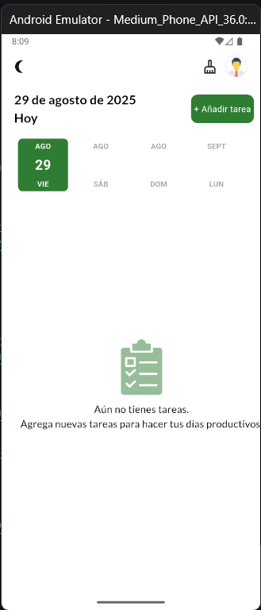
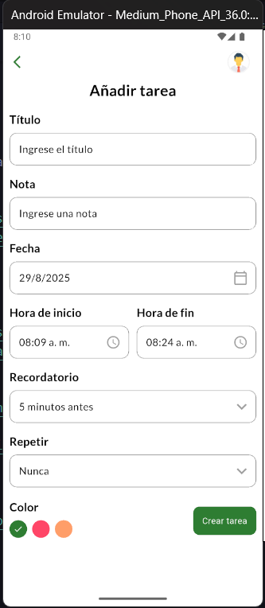
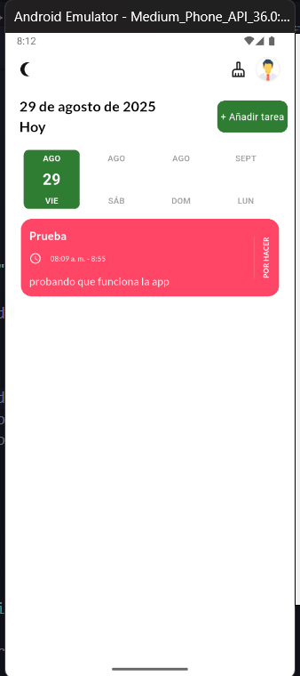

# Readme Español
# TODO App with Flutter

<div align="left">


</div>

Aplicación de tareas (To‑Do) construida con Flutter para organizar tus pendientes de forma rápida y agradable. Incluye recordatorios locales, priorización, persistencia y una UI moderna con soporte multi‑plataforma.

## Características

- Crear tareas con fecha de vencimiento.
- Marcar tareas como completadas y eliminarlas.
- Asignar prioridades a cada tarea.
- Recordatorios mediante notificaciones locales.
- Soporte de tema claro/oscuro (según capturas).
- Persistencia local con base de datos.

## Screenshots
 



 
Descripciones de las capturas (archivos en `todo/images/`):

- 1.png — Inicio (Español, tema claro, acento de color verde)
- 2.png — Añadir tarea (formulario en español con validaciones y selección de tiempos)
- 3.png — Lista con tarea creada (estado Por Hacer y acentos verdes)
 
## Empezar (rápido)

Sigue estos pasos para ejecutar el proyecto en tu equipo.

### Requisitos previos

- Flutter SDK instalado y configurado correctamente. Ver [instalación de Flutter][flutter-install].
- Dispositivo o emulador Android/iOS; o entorno de escritorio/web configurado.

### Instalación y ejecución

1) Clona este repositorio:

```bash
git clone <URL-de-tu-repo>
```

2) Entra a la carpeta del proyecto Flutter:

```bash
cd To-Do-App/todo
```

3) Instala dependencias:

```bash
flutter pub get
```

4) Ejecuta la app en el dispositivo objetivo:

```bash
flutter run
```

5) Formatos y análisis opcionales:

```bash
flutter format .
flutter analyze
flutter test
```
 
## Dependencies
 
Paquetes relevantes utilizados (ver `todo/pubspec.yaml` para versiones exactas):

- [Flutter][flutter] y [flutter_localizations][flutter-localizations]
- [GetX (get)][get] y [Get Storage][get-storage]
- [flutter_local_notifications][fln] + [timezone][timezone] + [flutter_timezone][flutter-timezone]
- [intl][intl] y [google_fonts][google-fonts]
- [date_picker_timeline][date-picker]
- [sqflite][sqflite] (persistencia local)
- [flutter_staggered_animations][staggered]
- [flutter_svg][flutter-svg]
- [rxdart][rxdart]

Versionado actual (según `pubspec.yaml`):

```
Dart SDK: >=3.0.6 <4.0.0
cupertino_icons: ^1.0.2
get_storage: ^2.0.3
get: ^4.3.8
flutter_local_notifications: ^19.4.0
intl: ^0.20.2
google_fonts: ^6.3.0
date_picker_timeline: ^1.2.3
sqflite: ^2.0.0+4
flutter_staggered_animations: ^1.0.0
flutter_svg: ^2.0.7
rxdart: ^0.28.0
timezone: ^0.10.1
flutter_timezone: ^4.1.1
```

## Estructura del proyecto (resumen)

Ruta principal del código: `To-Do-App/todo/`

- `lib/` Código fuente de la app (vistas, controladores, servicios, modelos).
- `images/` Activos estáticos como íconos e ilustraciones.
- `android/`, `ios/`, `web/`, `windows/`, `macos/`, `linux/` plataformas soportadas.
- `test/` Pruebas unitarias.

## Notas de plataforma

- Notificaciones locales: asegúrate de completar la configuración específica en Android/iOS (permisos, canales, íconos de notificación). Refiérete a la guía de [flutter_local_notifications][fln-docs].
- Zona horaria: configura correctamente el paquete [timezone][timezone] y [flutter_timezone][flutter-timezone] para programar recordatorios en la hora local del dispositivo.
- En iOS, recuerda activar permisos de notificación y agregar cadenas de uso en `Info.plist`.

## Cambios destacados

- UI refinada con tema claro/oscuro.
- Gestión de tareas con fecha, prioridad y estado.
- Persistencia local y recordatorios.

Si realizaste cambios adicionales como refactorización, nuevos widgets o mejoras de accesibilidad, documéntalos aquí para que el revisor los identifique fácilmente.

## Cambios realizados por esta entrega

- Idioma de la aplicación: de inglés a español (fechas, etiquetas, botones y textos).
- Paleta principal: de azul a verde para elementos claves (botones, calendario y acentos).
- Capturas actualizadas para reflejar el nuevo idioma y color.

## Roadmap (ideas)

- Filtros avanzados (por fecha, prioridad, estado).
- Búsqueda de tareas.
- Sincronización en la nube/backup.
- Widgets de hogar y acciones rápidas.

## Créditos

- Construido con [Flutter][flutter] y [Dart][dart].
- Librerías de la comunidad: ver sección de dependencias.

---

¿Sugerencias o problemas? Abre un issue o envía un PR. ¡Gracias por revisar este proyecto!

[flutter]: https://flutter.dev/
[flutter-install]: https://docs.flutter.dev/get-started/install
[flutter-localizations]: https://docs.flutter.dev/development/accessibility-and-localization/internationalization
[dart]: https://dart.dev/
[get]: https://pub.dev/packages/get
[get-storage]: https://pub.dev/packages/get_storage
[fln]: https://pub.dev/packages/flutter_local_notifications
[fln-docs]: https://pub.dev/packages/flutter_local_notifications#-readme-tab-
[intl]: https://pub.dev/packages/intl
[google-fonts]: https://pub.dev/packages/google_fonts
[date-picker]: https://pub.dev/packages/date_picker_timeline
[sqflite]: https://pub.dev/packages/sqflite
[staggered]: https://pub.dev/packages/flutter_staggered_animations
[flutter-svg]: https://pub.dev/packages/flutter_svg
[rxdart]: https://pub.dev/packages/rxdart
[timezone]: https://pub.dev/packages/timezone
[flutter-timezone]: https://pub.dev/packages/flutter_timezone
 
# Readme Original del autor

# TODO App with Flutter

A simple TODO app built using Flutter that helps you manage your tasks efficiently.

## Features

- Add tasks with due dates.
- Mark tasks as completed.
- Delete tasks you no longer need.
- Set task priorities.
- Receive local notifications for upcoming tasks.

## Screenshots


## Getting Started

Follow these instructions to get the project up and running on your local machine.

### Prerequisites

- Flutter SDK
- Android/iOS Emulator or Physical Device

### Installation

1. Clone the repository:

   ```bash
   git clone https://github.com/your-username/todo-app-flutter.git
   ```

2. Navigate to the project directory:

   ```bash
   cd todo-app-flutter
   ```

3. Install the dependencies:

   ```bash
   flutter pub get
   ```

4. Run the app:

   ```bash
   flutter run
   ```

## Dependencies

The app uses the following packages:

- `cupertino_icons: ^1.0.2`
- `get_storage: ^2.0.3`
- `get: ^4.3.8`
- `flutter_local_notifications: ^15.1.0+1`
- `intl: ^0.18.1`
- `google_fonts: ^5.1.0`
- `date_picker_timeline: ^1.2.3`
- `sqflite: ^2.0.0+4`
- `flutter_staggered_animations: ^1.0.0`
- `flutter_svg: ^2.0.7`
- `rxdart: ^0.27.2`
- `timezone: ^0.9.2`
- `flutter_timezone: ^1.0.7`

Make sure to add these dependencies to your `pubspec.yaml` file before running the app.
